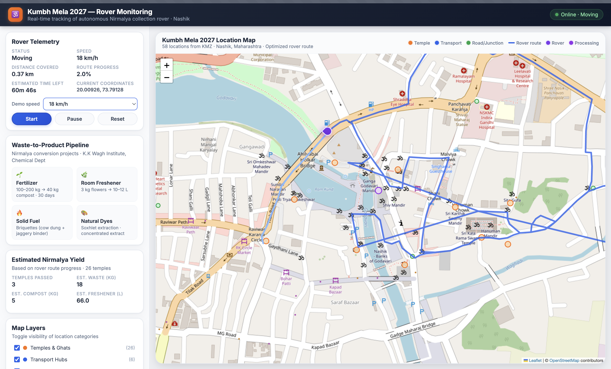
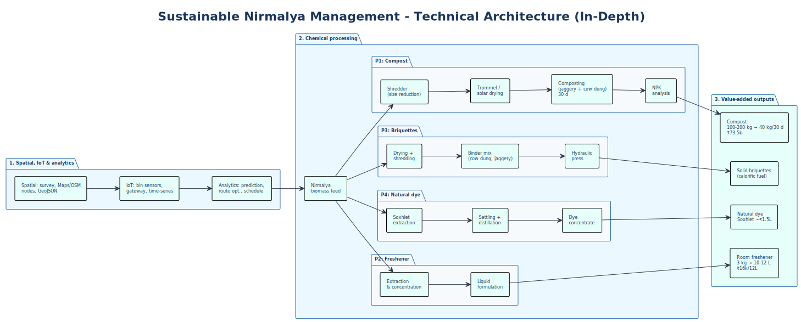

# Kumbh Mela 2027 — Nashik Rover Dashboard

Real-time monitoring dashboard for the autonomous Nirmalya collection rover at Kumbh Mela 2027 in Nashik, Maharashtra.

## Project structure

| Folder | Purpose |
|--------|--------|
| **`raspberry-pi/`** | Code and config for Raspberry Pi (rover hardware, sensors, scripts). |
| **`screenshots/`** | Screenshots and UI captures of the dashboard. |

## Screenshots

### Dashboard overview



*Kumbh Mela 2027 Rover Monitoring — telemetry, map layers, waste-to-product pipeline, and estimated Nirmalya yield.*

### Technical architecture (Nirmalya management)



*Sustainable Nirmalya Management — technical architecture: spatial/IoT/analytics, chemical processing (compost, room freshener, briquettes, natural dye), and value-added outputs.*

---

Add more screenshots in the `screenshots/` folder and reference them here, for example:

```markdown

```

## Running the dashboard

1. Serve the project (e.g. `npx serve` or any static server).
2. Open the app in a browser.
3. Use **Start** to run the rover along the route; **Pause** / **Reset** to control the demo.

## Tech

- Static HTML/CSS/JS
- Leaflet for the map
- Deployable on Vercel or any static host
